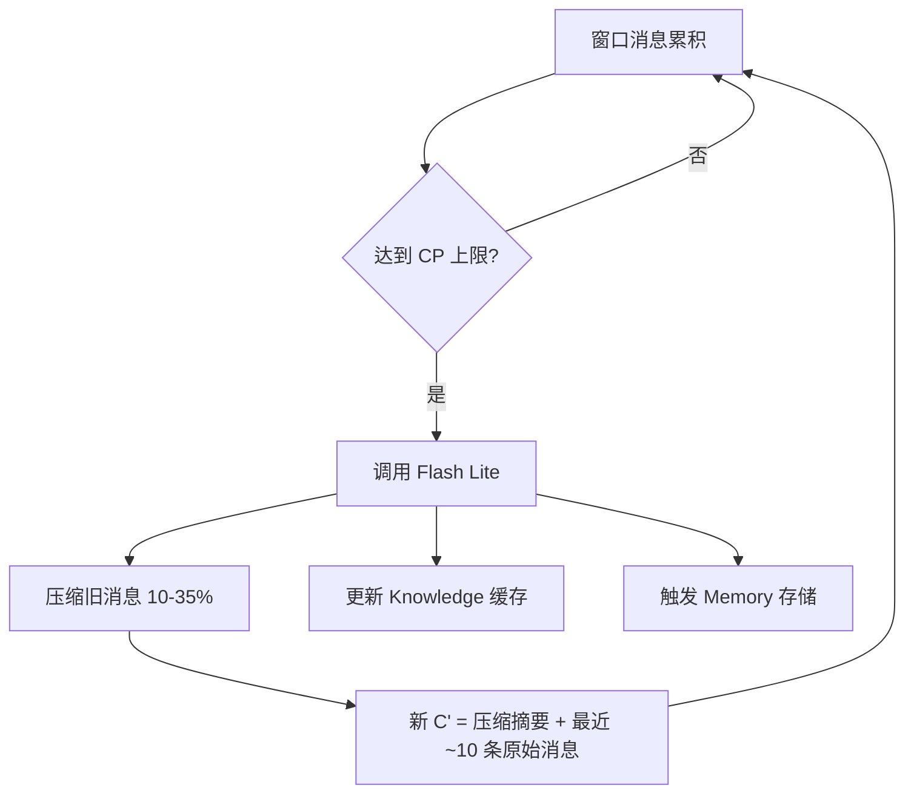
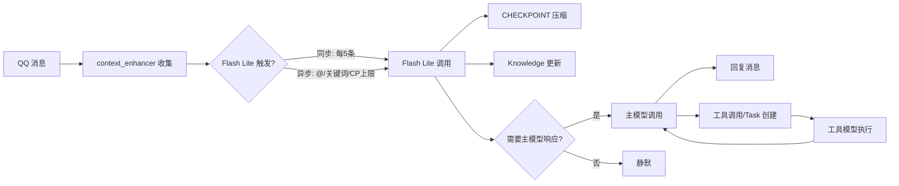

# 🏛️ 老板娘系统总架构 (Plan_1_architecture)

> 版本: v1.0（2026-04-02 大讨论成果）  
> 关联: [Plan_1.md](./Plan_1.md) | [Plan_1_models.md](./Plan_1_models.md) | [Plan_1_sandbox.md](./Plan_1_sandbox.md) | [Plan_1_memory.md](./Plan_1_memory.md)

---

## 核心理念

老板娘不是一个简单的聊天机器人，而是一套**类操作系统级别的 AI Agent 系统**。整体设计参考 Antigravity IDE 的 LS 进程架构思路，实现：
- 高效的上下文管理（CHECKPOINT 压缩 + KV Cache）
- 智能的多模型协作（Flash Lite 中断 + 主模型执行 + 工具模型干活）
- 安全的工具环境（Sandbox 空间）
- 持久的记忆体系（Memory + Knowledge 双系统）

---

## 两层式对话管理机制

### Layer 1：内存存储层 (C)

**本地原始对话存储**——所有群聊、所有窗口的完整消息流。

- 来源：NapCat → OneBot 11 → AstrBot → 插件
- 每个"窗口"（群/私聊）是一本"书"
- **不会自动删除**，需要我们自行管理
- 老板娘可随时"翻书"查看原始内容

> [!NOTE]
> 这里的"消息"不仅包括 QQ 消息，也包括模型自身在该窗口的工作记忆、任务记录等。

### Layer 2：请求体层 (C')

**实际发送给 API 的请求内容**——每次调用时动态构建。

```
C' = knowledge（全局缓存）
   + 系统环境说明
   + 角色设定内容
   + 工具系统 resource 说明（渐进式披露）
   + CHECKPOINT 压缩后的历史上下文
   + 最近 ~10 条未压缩消息
   + 工具调用/结果内容
```

> [!IMPORTANT]
> C' 中**大部分内容是固定/缓慢变化的**（knowledge、系统说明、角色设定、工具说明），天然适合 KV Cache。每次请求的增量仅为最近几条新消息。

---

## CHECKPOINT 压缩机制

### 触发条件
- 每个窗口设定一个 **token 估计上限**
- 图片、文件等非文本内容按等效 token 计算
- 达到上限时触发 **Flash Lite 模型** 进行压缩

### 压缩流程



### 压缩规则
- 压缩率：10%-35%（告知 AI 目标压缩率）
- 最近 **~10 条消息不压缩**（即使总量超过 CP 上限）
- 压缩时同步更新 Knowledge 中该窗口的内容
- 压缩时触发 Memory 系统存储重要信息
- 效果：**每个窗口的 RNN 级别滚动对话**

### 撤回处理
- 消息撤回事件由 `recall_cancel` 插件捕获
- 撤回发生时：从 C（原始存储）重建受影响的上下文
- 更新 C' 中的 CHECKPOINT 压缩内容

---

## 模型触发流程

> 详见 [Plan_1_models.md](./Plan_1_models.md)



---

## 系统组件关系

```
                    ┌─────────────────────────┐
                    │     QQ 消息流（NapCat）    │
                    └──────────┬──────────────┘
                               │
                    ┌──────────▼──────────────┐
                    │   AstrBot 消息管道        │
                    │   context_enhancer 收集    │
                    └──────────┬──────────────┘
                               │
                ┌──────────────▼──────────────────┐
                │     Flash Lite 中断事件处理器      │
                │  ┌──────┬──────┬──────┐         │
                │  │CP压缩│KN更新│触发判断│         │
                │  └──────┴──────┴──────┘         │
                └──────────────┬──────────────────┘
                      需要响应时│
                ┌──────────────▼──────────────────┐
                │          主模型（Pro/Flash）       │
                │  ┌──────┬──────┬──────┬──────┐  │
                │  │回复  │工具  │Task  │记忆  │  │
                │  └──────┴──┬───┴──────┴──────┘  │
                └────────────┼────────────────────┘
                             │
                ┌────────────▼────────────────────┐
                │     Sandbox 空间 + 工具模型        │
                │  ┌────────┐ ┌──────────────┐    │
                │  │基础工具 │ │ 自定义工具区  │    │
                │  │(只读)  │ │ (可读写创建) │    │
                │  └────────┘ └──────────────┘    │
                └─────────────────────────────────┘
```

---

## "无对话态"设计哲学

> [!IMPORTANT]
> 本系统**不需要传统的"对话态"概念**。

传统方案的问题：
- 对话态 = 用户 @后进入，超时退出 → 是一个硬编码的状态机
- 无法判断"不是在跟老板娘说话"的情况
- 多人同时对话时状态混乱

本系统的解法：
- **Flash Lite 每 ~5 条群消息触发一次**，负责判断是否需要主模型响应
- @/关键词触发时直接异步调用 → 保证响应
- 普通消息由 Flash Lite 的语义判断决定 → 智能而非硬编码
- 成本极低：Flash Lite 调用费用 ≈ 0
- 上下文通过 CHECKPOINT 动态管理 → 无需固定窗口

---

## 文件结构（Plan 系列）

```
QQBotPlan/
├── Plan_1.md                    ← 总纲领（Stage 路线图）
├── Plan_1_architecture.md       ← 本文件（系统总架构）
├── Plan_1_models.md             ← 三模型分工设计
├── Plan_1_sandbox.md            ← Sandbox 空间设计
├── Plan_1_memory.md             ← Memory + Knowledge 双系统
├── Plan_1_data.md               ← 数据层真相 + API 参数参考
└── Task.md                      ← Stage 执行清单
```
