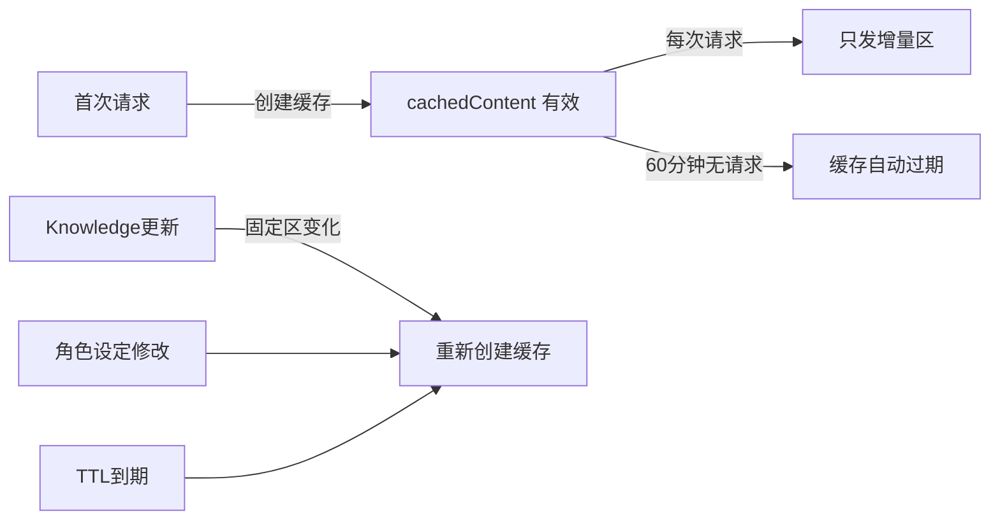

# 🔍 Plan 文件 GAP 补充 (Plan_1_gaps)

> 本文件记录 Review 讨论记录后发现的缺失/不够详细的内容，作为各 Plan 文件的补丁

---

## GAP 1：Stage 编号需要重新排列

> [!IMPORTANT]
> 消息持久化层是整个系统的**前置基础设施**，没有它 QQ_data_original 工具无数据源，CHECKPOINT 无压缩对象，Knowledge 无更新来源。应提升到 Stage 4（紧随当前 Stage 3 之后）。

### 新的 Stage 排序建议

| 新编号 | 内容 | 原编号 | 说明 |
|--------|------|--------|------|
| Stage 3 | 多模态视觉 | 不变 | 验证图片处理链路 |
| **Stage 4** | **消息持久化层** | 🆕 | 自建全量消息存储插件 |
| **Stage 5** | **Flash Lite 中断引擎** | 原 Stage 4 | 废弃"对话跟踪"概念，改为"中断引擎" |
| Stage 6 | CHECKPOINT 压缩机制 | 🆕（从架构拆出） | 依赖 Stage 4 的数据+Stage 5 的 Flash Lite |
| Stage 7 | KV Cache 优化 | 原 Stage 5 | 缓存固定上下文，降低 API 开销 |
| Stage 8 | Memory + Knowledge 双系统 | 原 Stage 6 | 记忆+知识缓存 |
| Stage 9 | Sandbox 空间集成 | 原 Stage 7 | 基础工具+workspace |
| Stage 10 | 主模型 Agent 集成 | 原 Stage 8 | 角色设定+工具+Task进程 |
| Stage 11 | 工具扩展 | 原 Stage 9 | MCP工具+自定义工具 |
| Stage 12 | 全链路联调 | 原 Stage 10 | 端到端测试 |

---

## GAP 2：消息持久化层 SQLite 表结构设计

补充 Plan_1_data.md：

```sql
-- 原始消息表（核心表）
CREATE TABLE qq_messages (
    id INTEGER PRIMARY KEY AUTOINCREMENT,
    window_type TEXT NOT NULL,          -- 'group' | 'private'
    window_id TEXT NOT NULL,            -- 群号或QQ号
    message_id TEXT,                    -- QQ消息ID（用于撤回关联）
    sender_id TEXT NOT NULL,            -- 发送者QQ号
    sender_name TEXT,                   -- 群昵称/群名片
    content_text TEXT,                  -- 纯文本内容
    content_raw JSON,                   -- 原始消息组件（图片URL、@、引用等）
    has_image BOOLEAN DEFAULT FALSE,
    image_urls JSON,                    -- 图片URL列表
    is_recalled BOOLEAN DEFAULT FALSE,  -- 是否已撤回
    recalled_at DATETIME,               -- 撤回时间
    created_at DATETIME NOT NULL DEFAULT CURRENT_TIMESTAMP,
    
    -- 索引
    INDEX idx_window (window_type, window_id, created_at),
    INDEX idx_sender (sender_id),
    INDEX idx_recall (message_id)
);

-- CHECKPOINT 压缩历史表
CREATE TABLE checkpoint_history (
    id INTEGER PRIMARY KEY AUTOINCREMENT,
    window_type TEXT NOT NULL,
    window_id TEXT NOT NULL,
    compressed_content TEXT NOT NULL,     -- 压缩后的摘要
    original_msg_range_start INTEGER,    -- 原始消息ID范围
    original_msg_range_end INTEGER,
    compression_ratio REAL,              -- 实际压缩率
    token_estimate INTEGER,              -- 压缩后的估算token数
    created_at DATETIME NOT NULL DEFAULT CURRENT_TIMESTAMP
);
```

### AstrBot 拦截点
- Hook 点：`on_message` 事件（所有平台消息的入口）
- 插件优先级：`priority=9999`（最高优先级，确保第一个拦截）
- 处理方式：**异步写入**，不阻塞消息处理流程
- 撤回处理：监听 OneBot `notice.group_recall` 事件，标记 `is_recalled=True`

---

## GAP 3：KV Cache 技术方案细节

### 缓存内容分区

```
固定区（≈95% 命中率，长时间不变）:
├── knowledge 缓存体                    ← Flash Lite 每次更新后重建
├── 系统环境说明 (env.json)
├── 角色设定内容（老板娘人格 Prompt）
└── 工具系统 resource 说明（渐进式披露的基础部分）

增量区（每次请求不同）:
├── 压缩后的 CHECKPOINT 历史
├── 最近未压缩消息
└── 工具调用/结果
```

### createCachedContent 生命周期



### 撤回消息的缓存重建
- 收到撤回事件 → 标记 `is_recalled=True` → 如果撤回消息在当前缓存的增量区内 → 丢弃当前缓存 → 下次请求重建
- 如果在 CHECKPOINT 已压缩的历史中 → 不需要重建（压缩摘要不包含已撤回的具体内容）

---

## GAP 4：主模型草稿纸机制补充

```
workspace/drafts/
├── plan.md          ← 当前任务规划（类似 implementation_plan.md）
├── task.md          ← 任务进度追踪（类似 task.md 的 checklist）
├── notes/           ← 临时笔记
│   ├── research.md
│   └── ...
└── cache/           ← 中间结果缓存
    ├── search_results.json
    └── ...
```

草稿纸工作流：
1. 主模型收到复杂任务 → 在 `drafts/plan.md` 规划步骤
2. 创建 Task 进程 → 在 `drafts/task.md` 跟踪进度
3. 子代理完成后 → 主模型 check → 更新 task.md
4. 最终结果 → 回复用户 + 更新 Memory

---

## GAP 5：多模态处理策略

### 图片处理决策树

```
群聊消息包含图片
    ├── 场景 A: 单张图片
    │   ├── Gemini 主模型可直接吃 → 原图传入（最佳体验）
    │   └── 但开销较大 → 视配置决定
    │
    ├── 场景 B: 多张图片（≥3张）
    │   ├── Flash Lite 批量描述 → 文字替代 → 显著降低 token
    │   └── 保留前2张原图 + 其余描述
    │
    ├── 场景 C: QQ 聊天记录截图（转发消息）
    │   ├── 识别为聊天记录（OCR / 格式特征）
    │   ├── Flash Lite 提取结构化内容
    │   └── 转为文字格式：「A说: xxx\nB说: yyy」
    │
    └── 场景 D: 表情包/梗图
        ├── Flash Lite 简短描述
        └── 「[表情包: 狗头.jpg - 一只柴犬做无奈表情]」
```

### 为什么要转述而不是全部直传？
1. **群聊天天发几十张图**，全部传主模型 = token 爆炸
2. **QQ 聊天记录截图**里有大量文字信息，OCR 提取比图传入更精确
3. **表情包**对主模型理解语义帮助有限，一句话描述足以
4. **KV Cache 友好**：文字描述可以被缓存命中，原图每次都不同

---

## GAP 6：对话跟踪问题的废弃声明

> [!NOTE]
> 原讨论中的讨论点 2-5（对话态超时、意图粒度、多人对话态、结束检测）在我们的架构下**全部废弃**。
> 
> 理由：Flash Lite 的语义判断完全取代了硬编码的"对话态"概念。没有状态机，没有超时，没有槽位——每次都是 Flash Lite 独立判断"这条消息是否需要主模型回复"。
>
> 这意味着：
> - 不需要"A 正在和老板娘对话"的状态
> - 不需要"90 秒超时退出对话"的逻辑
> - 不需要"多人对话槽"的管理
> - 不需要"886/好的"的结束词检测
> 
> Flash Lite 自然地处理了所有这些情况：如果 A 说完了话题转向 B，Flash Lite 自然会判断 A 的后续消息与老板娘无关，不触发主模型。

---

## GAP 7：可移植性强化

### 系统级目录结构

```
BossLady/                               ← 整个系统的根目录
├── AstrBot/                            ← AstrBot 主程序 + 插件 + 配置
│   ├── data/
│   │   ├── data_v4.db
│   │   ├── cmd_config.json
│   │   ├── plugins/                    ← 包含我们自己的插件
│   │   └── persona/
│   └── ...
├── QQ_data/                            ← 🆕 全量消息持久化（自管理）
│   ├── messages.db                     ← SQLite 数据库
│   └── media_cache/                    ← 可选：图片本地缓存
├── Sandbox/                            ← 🆕 模型的虚拟空间
│   ├── base_tools/
│   └── workspace/
├── Memory/                             ← 🆕 记忆系统
│   ├── memory.db
│   └── index/                          ← 可选：FAISS向量索引
├── Knowledge/                          ← 🆕 Knowledge 缓存
│   └── knowledge_cache.json
├── NapCat/                             ← NapCat 适配器
├── QQBotPlan/                          ← 规划文件（可选打包）
├── pack.bat                            ← 一键打包脚本
├── unpack.bat                          ← 一键恢复脚本
└── config.env                          ← API Keys（不打包）
```

### 打包排除项
- `__pycache__/`、`.venv/`、`node_modules/`
- `*.log` 日志文件
- `config.env`（API Keys 安全隔离）
- 临时媒体缓存（可选）

### 恢复流程
1. 解压 zip 到目标电脑
2. 手动创建 `config.env` 填入 API Keys
3. 运行 `unpack.bat`（安装 Python 依赖）
4. 启动 AstrBot + NapCat
