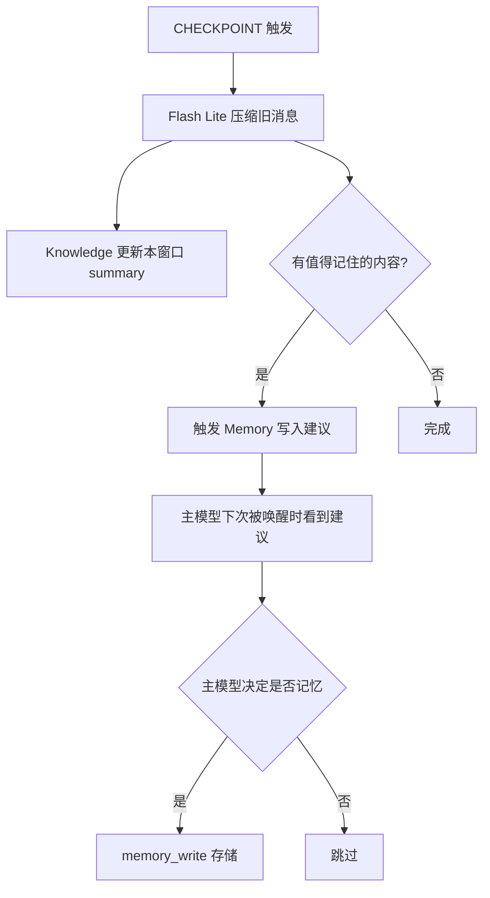

# 🧠 Memory + Knowledge 双系统设计 (Plan_1_memory)

> 关联: [Plan_1_architecture.md](./Plan_1_architecture.md) | [Plan_1_models.md](./Plan_1_models.md)

---

## 双系统定位对比

| 维度 | Memory 记忆系统 | Knowledge 知识缓存 |
|------|----------------|-------------------|
| 管理者 | **主模型**自主管理 | **Flash Lite** 自动维护 |
| 触发方式 | 主模型主动调用 MCP 工具 | Flash Lite 每次触发时自动更新 |
| 内容类型 | 精炼知识、用户画像、决策记录 | 近期对话梗概、窗口情况简报 |
| 检索方式 | 模糊搜索 → 定位 → 读原文 | 全量发送（每次请求带上整个 Knowledge） |
| 存储粒度 | 按主题/标签，跨窗口 | 按窗口分区，全局结构 |
| 持久性 | 长期持久化 | 短期缓存，随 Flash Lite 滚动更新 |
| 类比 | 你的 memory-store MCP | 你的 Knowledge Items 系统 |

---

## Memory 记忆系统

### 设计原则
参考 Antigravity IDE 的 memory-store MCP，但要做得**更好**：
- 主模型自己决定什么值得记住
- 模糊搜索模式——模型大概回忆内容，然后精确定位
- 可以像 `conversation_read_original` 那样，从模糊记忆跳转到原始消息读原文

### 功能
- `memory_write`: 写入记忆（标题+内容+标签+工作区）
- `memory_query`: 搜索记忆（自然语言/标签/全文检索）
- `memory_read`: 读取完整记忆内容
- `memory_update`: 更新/追加记忆
- `memory_delete`: 删除记忆

### 工作区划分
- 每个群号/QQ号 → 独立工作区
- `general` → 全局通用记忆
- 支持跨工作区搜索

### 与 QQ_data_original 联动
- 记忆中存储的是**精炼过的知识**
- 需要细节时，通过 `QQ_data_original` 工具回到原始消息查看
- 类似：memory 告诉你"上次在 A 群讨论过 Python 学习"→ 用 QQ_data_original 去 A 群找原始记录

### 用户画像
- 基于 Memory 系统 + 群号/QQ号档案
- 模型自行维护每个用户的：
  - 昵称偏好、说话风格
  - 常聊话题、兴趣标签
  - 关键事件记录
  - 好感度（模型自行判断和更新）
- 配合 Knowledge 缓存的近期对话 → 实现"记得住 + 用得上"

---

## Knowledge 知识缓存

### 设计原则
参考 Antigravity IDE 的 Knowledge Items 系统，但定位不同：
- **不是持久化知识**，而是**近期对话的实时缓存**
- Flash Lite 每次触发时自动更新
- 全局发送——每次模型请求都带上完整 Knowledge

### 结构

```json
{
  "last_updated": "2026-04-02T03:00:00+08:00",
  "windows": {
    "GroupMessage:<GROUP_B>": {
      "name": "水桶理论闲聊群",
      "last_active": "2 分钟前",
      "summary": "最近在讨论老板娘的新功能，Jury 问了人格设定。古希腊掌管铯欲的神发了几张表情图。",
      "active_users": ["Jury_鸽姬布", "古希腊掌管铯欲的神"],
      "mood": "轻松闲聊",
      "recent_topics": ["老板娘功能", "表情包"]
    },
    "PrivateMessage:<ADMIN_QQ>": {
      "name": "Jury（管理员）",
      "last_active": "30 分钟前",
      "summary": "在配置老板娘的系统架构，讨论了 KV Cache 和记忆系统设计。",
      "mood": "工作模式"
    }
  },
  "recent_operations": [
    "搜索了 Python 教程相关图片",
    "在群里发了一条引用回复"
  ]
}
```

### 更新机制
- Flash Lite 每次触发时：
  1. 排出该窗口中过时的旧 summary
  2. 根据最新消息更新 summary 和 active_users
  3. 更新 recent_operations
- Knowledge 是**增量更新**，不是每次全量重写
- 内容简短但梗概清晰——不需要详细，只需要模型知道"最近大概发生了什么"

### 大小控制
- 每个窗口的 summary 限制在 200-500 字
- 全局 Knowledge 不超过 2000-3000 token
- 不活跃窗口的条目自动过期清除

---

## 与 CHECKPOINT 的协作



> [!NOTE]
> Memory 写入的最终决策权在**主模型**手里。Flash Lite 只是标记"这些内容可能值得记住"，主模型自己判断是否记忆。这保证了记忆质量——只有主模型认为重要的才会被记住。

---

## 指针系统

### 设计理念
所有内部交互使用**地址指针**进行引用：

| 指针类型 | 格式 | 示例 |
|----------|------|------|
| 窗口指针 | `{type}:{id}` | `GroupMessage:<GROUP_B>` |
| 消息指针 | `{window}#msg_{id}` | `GroupMessage:<GROUP_B>#msg_12345` |
| 文件指针 | `sandbox://{path}` | `sandbox://workspace/drafts/plan.md` |
| 记忆指针 | `memory://{id}` | `memory://user_profile_jury` |
| Knowledge 指针 | `knowledge://{window}` | `knowledge://GroupMessage:<GROUP_B>` |

- 类似 Plan_1 系列总纲记载子 md 地址
- `json` 格式命令传输，`md` 格式内容传输
- 高效的分层渐进式信息引用

---

## 与现有系统的集成路径

| 现有组件 | 集成方式 |
|----------|----------|
| AstrBot `long_term_memory` | 替换为新的 Memory 系统 |
| `context_enhancer` | 复用其消息收集 → 喂给 Flash Lite |
| `recall_cancel` | hook 撤回事件 → 触发缓存重建 |
| `knowledge_base` | 复用 FAISS 基础设施做向量检索（可选） |
| AstrBot conversation history | 作为 QQ_data_original 的数据源 |
