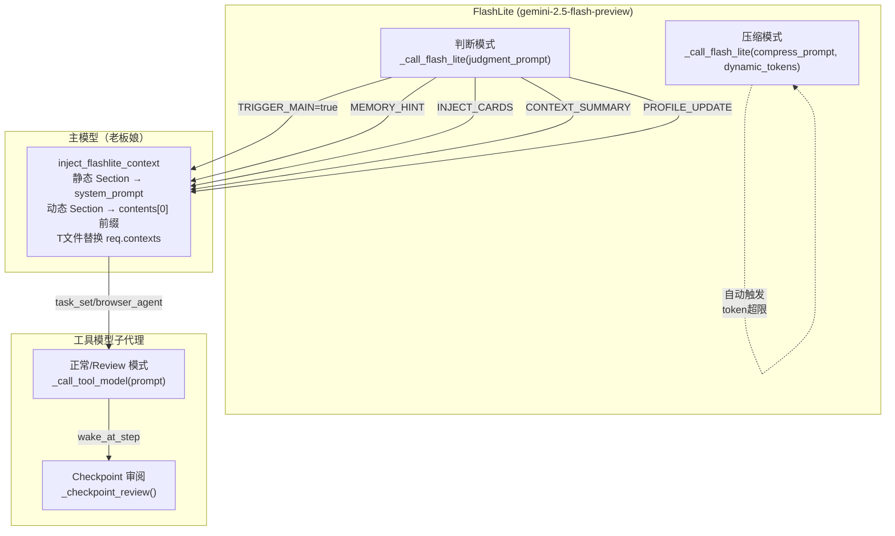

# 提示词审计总览

> 审计时间：2026-04-13 (更新) | 代码版本：当日最新
> 基于 `main.py` (5945行) + `checkpoint.py` (934行) + `agent.py` (220行) 源码逐行提取

---

## 一、审计文档清单

| 文件名 | 对应模型 | 调用模式 | 说明 |
|--------|---------|---------|------|
| [Prompt_FlashLite_判断.md](./Prompt_FlashLite_判断.md) | FlashLite (gemini-2.5-flash-preview) | 中断判断 | system + 动态前缀 + judgment prompt |
| [Prompt_FlashLite_压缩.md](./Prompt_FlashLite_压缩.md) | FlashLite (同上) | CHECKPOINT 压缩 | system(共用) + 动态前缀 + compress prompt |
| [Prompt_主模型.md](./Prompt_主模型.md) | 主模型（老板娘）| 日常对话 | Part 1: persona + 静态 Section 0-8 |
| [Prompt_主模型_Part2.md](./Prompt_主模型_Part2.md) | 主模型（老板娘）| 日常对话 | Part 2: Section 9-15 + 动态区 + T文件上下文 |
| [Prompt_工具模型.md](./Prompt_工具模型.md) | 工具模型子代理 | 三种模式 | 正常/Review/Checkpoint审阅 |

---

## 二、三模型调用架构



---

## 三、每个模型的 Prompt 构成简图

### FlashLite 判断模式
```
systemInstruction:                          ← 纯静态 100% KVCache 命中
  └─ _build_flash_lite_system()             ← 身份+消息格式+核心职责+触发条件+输出格式+任务指南

contents[user]:                             ← 每次变化
  ├─ # 当前 Knowledge 快照                  ← 动态: knowledge.get_prompt_text()
  ├─ # 系统时间                              ← 动态: datetime.now()
  ├─ ## Memory 索引                          ← 动态: _build_memory_mini_index()
  ├─ ---
  └─ _build_judgment_prompt()               ← 动态: 窗口类型+摘要+消息记录+触发信息
```

### FlashLite 压缩模式
```
systemInstruction:                          ← 与判断模式完全相同（共用）
  └─ (同上)

contents[user]:                             ← 每次变化
  ├─ # 当前 Knowledge 快照                  ← 同上
  ├─ # 系统时间                              ← 同上
  ├─ ## Memory 索引                          ← 同上
  ├─ ---
  └─ build_compress_prompt()                ← 压缩专用: 输出要求+压缩原则+格式+待压缩内容
```

### 主模型（老板娘）
```
system_prompt:
  ├─ AstrBot persona (框架注入)              ← 角色人格（用户自定义）
  └─ inject_parts (FlashLite 追加 静态):
      ├─ S0: 体系认知                        ← 必注入
      ├─ S1: 输出风格约束                    ← 必注入
      ├─ S7: 工具集说明 (ToolRegistry brief) ← 必注入
      ├─ S8: 回复格式+工具规范               ← 必注入
      ├─ S9: Memory 指南                     ← 必注入
      ├─ S10: Knowledge 说明                 ← 必注入
      ├─ S11: 文件处理规范                   ← 必注入
      ├─ S12: Sandbox 空间                   ← 必注入
      ├─ S13: 自定义工具                     ← 必注入
      ├─ S14: Task 系统                      ← 必注入
      └─ S15: 工具速查                       ← 必注入

contents[0].user 前缀 (动态):
  ├─ D0: 当前时间                            ← 必注入
  ├─ D1: Knowledge 全局缓存                  ← 条件（有内容时）
  ├─ D2: FlashLite 上下文摘要+最近消息       ← 条件（TRIGGER=true）
  ├─ D3: Memory 被动召回                     ← 条件（有 MEMORY_HINT）
  ├─ D4: 用户卡片                            ← 条件（有 INJECT_CARDS）
  └─ D5: Sandbox 环境说明                    ← 条件（env.json 存在）

req.contexts (T文件替换):
  └─ build_llm_contexts(t_file)             ← T1 压缩摘要 + 近期未压缩消息
```

### 工具模型子代理
```
正常/Review:
  systemInstruction:
    └─ _build_tool_model_system()            ← 身份+环境+工具+Review职责

  contents[user]:
    └─ prompt                                 ← 任务描述（无对话上下文，除非 inject_context）

  tools:
    └─ functionDeclarations[]                ← 核心三件套 + base_tools 动态扩展

Checkpoint 审阅:
  systemInstruction:
    └─ 老板娘 persona + 审阅模式指令          ← 完全不同的 system

  contents[user]:
    └─ 任务进度+结果 JSON                     ← 审阅内容
```

---

## 四、关键发现与改进建议

| # | 发现 | 影响 | 状态 |
|---|------|------|------|
| 1 | FlashLite 压缩模式共用判断 system prompt | 冗余 ~2000+ token | 低优先级（KVCache 命中率收益 > 冗余成本） |
| 2 | 工具模型无对话上下文 | 设计如此 | 已有 `inject_context` 可选参数 |
| 3 | 主模型 Section 编号不连续 | 无功能影响 | 历史原因，2-6 为动态区 |
| 4 | Knowledge 快照在三个模型中都有 | 一致性好 | 无需改动 |
| 5 | Memory 迷你索引仅 FlashLite 使用 | 合理——主模型通过被动召回获取 | 无需改动 |
| 6 | TOOL_CALL_PROMPT 已移除 | FlashLite S8 完整覆盖工具规范 | ✅ 设计确认 |
| 7 | 输出风格约束 Section 1 放在 S0 之后 | 确保最高优先级 | 最优位置 |

---

## 五、KVCache 优化策略总结

| 模型 | 策略 | 静态率 | 说明 |
|------|------|-------|------|
| FlashLite | system 纯静态 + user 动态 | ~100% system 命中 | 显式 KVCache 优先，降级隐式 |
| 主模型 | system = persona + inject_parts | ~95%+ | inject_parts 全静态，persona 很少变 |
| 工具模型 | system = _build_tool_model_system() | ~99% | sandbox_path 和 tool_list 初始化后不变 |

---

## 六、变更日志

| 日期 | 变更内容 |
|------|---------|
| 2026-04-10 | 初版创建（4文档），从源码逐行提取全部提示词文本 |
| 2026-04-13 | **全量更新**：基于 5945 行最新代码重新提取 |
| | 主模型拆分为 Part1 + Part2（静态区 + 动态区） |
| | 新增 Section 编号与 KVCache 优化策略映射 |
| | 更新架构图：增加 CONTEXT_SUMMARY/PROFILE_UPDATE 数据流 |
| | 压缩模式补充 v2 设计理念和动态 maxOutputTokens 计算 |
| | 标记 TOOL_CALL_PROMPT 移除为设计确认 |
